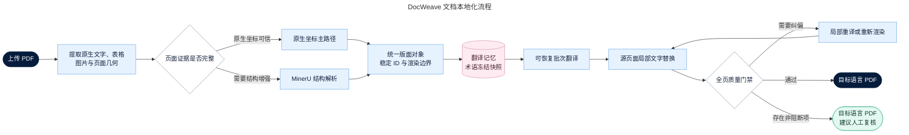

<div align="center">
  

# DocWeave

### 面向专业 PDF 的版式保真本地化工作台

**在自己的设备上完成解析、翻译、版面回写与全页质检。**


[](https://github.com/bujiuzhi/DocWeave/stargazers)

[快速开始](#快速开始) · [核心能力](#核心能力) · [工作原理](#工作原理) · [配置](#配置) · [开发与验证](#开发与验证) · [文档导航](#文档导航)
</div>

---

DocWeave 将机器生成 PDF、扫描件、复杂表格和图文混排文档转换为目标语言版本，同时尽可能保留原页面尺寸、坐标、图形、表格边界和分页结构。它以原 PDF 为版面底稿，结合原生文字坐标、MinerU 结构解析和 OpenAI 兼容模型完成翻译、局部回写、质量检查与可恢复处理。

> [!NOTE]
> DocWeave 定位为个人本地自部署工具。默认仅监听 `127.0.0.1`，文档、数据库和处理结果保存在自己的设备中；只有解析或翻译所必需的内容会按配置发送至 MinerU 与 LLM 服务。

| 🧩 版式保真 | 🔒 本地优先 | ✅ 可验证交付 |
|:---:|:---:|:---:|
| 保留页面、表格、图片与图形结构 | 密钥仅由后端环境变量读取 | 自动检查残留、溢出与数字一致性 |

## 为什么选择 DocWeave

传统 PDF 翻译通常先提取顺序文本，再生成一份重新排版的文档。这种方式容易丢失表格拓扑、图表标签、分页关系和原始视觉层次。DocWeave 采用坐标驱动的局部替换策略：

- 原生文字优先沿用 PDF 中的精确坐标和样式。
- MinerU 主要补充区域语义、阅读顺序和扫描件结构。
- 表格必须通过逻辑结构与真实网格双重校验后才逐格回写。
- 图片与矢量图形保留在原页面，避免整页重排造成版式漂移。
- 翻译、渲染和质检均可回溯到稳定文本块 ID。

DocWeave 适合技术资料、产品手册、研究报告、规格书，以及包含复杂表格或图表的固定版式文档。对于路径化文字、严重破损字形、复杂渐变背景和无法可靠定位的图片文字，系统会保留原内容或给出复核建议，而不是强制覆盖。

## 核心能力

| 能力 | 说明 |
|---|---|
| 多路径解析 | 在原生坐标、MinerU 结构解析和异构证据融合之间按页面选择路径 |
| 版式保真回写 | 保留页面尺寸、图片、矢量图形、表格边界和分页，以原坐标写入译文 |
| 表格保护 | 交叉验证逻辑行列、合并关系和图片网格，证据不足时保留原表格 |
| 批量任务 | 单批最多选择 50 个 PDF，前端最多并发提交 4 个，单文件上限 200 MB |
| 可恢复翻译 | 按页面和小批次持久化结果；重启后复用已完成批次，失败批次递归拆分 |
| 翻译记忆 | 仅在语言方向、完整策略和流水线版本一致时精确复用，不做高风险模糊匹配 |
| 术语管理 | 支持手动术语、任务冻结快照、候选审核和高置信度自动录入 |
| 自动修复 | 对文本溢出、容量不足和可定位残留执行局部重译或重新渲染 |
| 全页质量门禁 | 检查页数、尺寸、残留、数字一致性、溢出、最小字号和非文字内容变化 |
| 持久化报告 | SQLite 保存任务、日志、阶段耗时、Token、批次、质量问题和结果版本 |

任务状态按真实执行阶段更新：

```text
排队 → 分析 → 切分 → 翻译 → 自动修复 → 渲染 → 全页质检
                                                  ├─ 已完成
                                                  ├─ 已完成（建议复核）
                                                  └─ 失败
```

## 工作原理



详细的数据契约、解析路径和质量规则见[系统架构](docs/architecture.md)与[自动化流水线设计](docs/automated-pipeline-upgrade.md)。

## 快速开始

从配置到打开工作台只需三步：

```text
复制配置 → 填写模型服务 → 启动 Compose
```

### Docker Compose（推荐）

需要 Docker Engine 和 Docker Compose。

```bash
cp .env.example .env
```

编辑 `.env`，至少配置：

```dotenv
LLM_BASE_URL=https://api.example.com/v1
LLM_API_KEY=your-api-key
```

启动服务：

```bash
docker compose up -d --build
docker compose ps
curl http://127.0.0.1:18080/healthz
curl http://127.0.0.1:18080/api/v1/health
```

浏览器打开 `http://127.0.0.1:18080`。运行数据默认保存在被 Git 忽略的 `data/`，停止服务使用：

```bash
docker compose down --remove-orphans
```

### 本地开发

后端使用 Python 3.12：

```bash
conda create -n docweave python=3.12 -y
conda activate docweave
python3 -m pip install -r backend/requirements.txt

cp .env.example .env
set -a
source .env
set +a

uvicorn app.main:app --app-dir backend --reload --port 8000
```

前端使用 Node.js 24 和 pnpm：

```bash
pnpm --dir frontend install --frozen-lockfile
pnpm --dir frontend dev
```

开发服务器启动后，按终端提示访问前端地址。前端通过同源 `/api/v1/` 接口调用后端；本地代理行为以 [Vite 配置](frontend/vite.config.ts)为准。

## 配置

所有服务地址和密钥均由后端环境变量管理。API Key 不进入浏览器存储、前端源码或任务数据。

| 变量 | 默认值 | 用途 |
|---|---|---|
| `LLM_BASE_URL` | 无有效默认服务 | OpenAI 兼容 Chat Completions 地址 |
| `LLM_API_KEY` | 空 | LLM 服务密钥 |
| `DOCWEAVE_ALLOW_INSECURE_LLM_HTTP` | `false` | 显式允许可信隔离网络中的远程明文 HTTP |
| `MINERU_HOST` / `MINERU_PORT` | `127.0.0.1` / `8000` | MinerU 服务连接 |
| `MINERU_BASE_URL` | 由主机与端口生成 | 完整 MinerU 地址，可覆盖上述配置 |
| `DOCWEAVE_BIND_ADDRESS` | `127.0.0.1` | Compose 前端监听地址 |
| `DOCWEAVE_HTTP_PORT` | `18080` | Compose 前端端口 |
| `DOCWEAVE_DATA_DIR` | `./data` | SQLite、上传文件与结果目录 |
| `DOCWEAVE_WORKERS` | `4` | 并发任务工作线程数 |
| `LLM_BATCH_WORKERS` | `3` | 单文档文本批次并发数 |
| `LLM_VISION_WORKERS` | `2` | 图片识别与视觉复检并发数 |
| `MINERU_TIMEOUT_SECONDS` | `900` | MinerU 请求超时 |
| `LLM_TIMEOUT_SECONDS` | `300` | LLM 请求超时 |

完整字段、重试次数和质量开关见 [.env.example](.env.example)。远程 LLM 默认必须使用 HTTPS；环回 HTTP 只用于本机开发。

## 技术栈与目录

| 层级 | 技术 |
|---|---|
| 前端 | Vue 3、TypeScript、Vite |
| API 与任务编排 | FastAPI、Pydantic、线程池 |
| PDF 处理 | PyMuPDF、pypdf、pdfplumber、ReportLab |
| 持久化 | SQLite、本地文件目录 |
| 外部服务 | MinerU、OpenAI 兼容 Chat Completions API |
| 部署 | Docker Compose、Nginx |

```text
DocWeave/
├── backend/                # FastAPI、领域模型、流水线和测试
├── frontend/               # Vue 3 单页应用
├── docs/                   # 当前有效的架构与运维文档
├── infra/                  # Docker 与 Nginx 配置
├── .github/                # CI、安全分析、依赖更新和协作模板
├── data/                   # 运行数据（自动生成，不提交 Git）
├── compose.yaml
├── environment.yml
└── .env.example
```

## 开发与验证

安装开发依赖后执行完整检查：

```bash
python3 -m pip install -r backend/requirements-dev.txt
python3 -m pytest -q
python3 -m bandit -r backend/app
python3 -m pip_audit -r backend/requirements.txt

pnpm --dir frontend install --frozen-lockfile
pnpm --dir frontend build
pnpm --dir frontend audit --prod
```

当前本地验证基线：84 项后端测试通过，Bandit 0 问题，Python 与 npm 依赖审计均无已知漏洞，前端生产构建通过。CI 会重复执行测试、构建、依赖审计、Bandit、CodeQL 和依赖变更审查。

参与开发前请阅读[贡献指南](CONTRIBUTING.md)和[社区行为准则](CODE_OF_CONDUCT.md)。

## API 概览

| 方法 | 路径 | 用途 |
|---|---|---|
| `POST` | `/api/v1/jobs` | 上传 PDF 并创建任务 |
| `GET` | `/api/v1/jobs` | 查询任务列表 |
| `GET` | `/api/v1/jobs/{id}` | 查询任务状态 |
| `GET` | `/api/v1/jobs/{id}/details` | 查询日志、指标和质量问题 |
| `GET` | `/api/v1/jobs/{id}/download` | 下载结果 PDF |
| `POST` | `/api/v1/jobs/{id}/reprocess` | 使用当前流水线重新处理 |
| `DELETE` | `/api/v1/jobs/{id}` | 取消未完成任务 |
| `GET/POST/DELETE` | `/api/v1/glossary` | 管理正式术语 |
| `GET` | `/api/v1/glossary-candidates` | 查询术语候选 |

服务启动后可通过 `/docs` 查看 FastAPI 自动生成的交互式 API 文档。

## 安全边界

DocWeave 面向个人本地自部署，不提供用户认证、租户隔离或公网限流能力。Compose 默认只监听 `127.0.0.1`，保持默认配置即可从本机浏览器使用；不要将监听地址改成 `0.0.0.0` 后直接暴露到公网。

上传文档、术语、翻译记忆、日志和结果保存在本地 `data/` 目录，但解析与翻译内容可能发送给你配置的 MinerU 或 LLM 服务。处理敏感文档前，应确认所选服务的数据政策，或改用完全本地的兼容服务。密钥只应写入未提交的 `.env` 或密钥管理服务。详见[安全策略](SECURITY.md)与[安全部署指南](docs/security-deployment.md)。安全漏洞不要通过公开 Issue 披露。

## 文档导航

| 文档 | 内容 |
|---|---|
| [文档索引](docs/README.md) | 技术文档总入口 |
| [系统架构](docs/architecture.md) | 领域边界、数据流、处理路径和能力边界 |
| [自动化流水线](docs/automated-pipeline-upgrade.md) | 解析、翻译、渲染、质检和状态设计 |
| [安全部署指南](docs/security-deployment.md) | 网络、密钥、数据、容器和发布检查 |
| [贡献指南](CONTRIBUTING.md) | 开发环境、变更要求和验证方式 |
| [安全策略](SECURITY.md) | 漏洞报告渠道和支持范围 |
| [支持说明](SUPPORT.md) | Issue 范围和问题报告要求 |
| [变更日志](CHANGELOG.md) | 版本变更记录 |
| [第三方依赖说明](THIRD_PARTY_NOTICES.md) | 关键依赖许可证及发布约束 |

## 开源状态

DocWeave 采用 [GNU Affero General Public License v3.0](LICENSE)（`AGPL-3.0-only`），与项目使用 PyMuPDF 的 AGPL 开源许可路径保持一致。修改版本通过网络向用户提供服务时，也需要按 AGPLv3 要求向这些用户提供对应源代码。

第三方组件仍分别遵循其自身许可证，详见[第三方依赖说明](THIRD_PARTY_NOTICES.md)。

## Contributors

感谢所有参与 DocWeave 的贡献者：

<a href="https://github.com/bujiuzhi/DocWeave/graphs/contributors">
  
</a>

## Star History

<a href="https://www.star-history.com/?repos=bujiuzhi%2FDocWeave&type=date&legend=top-left">
  <picture>
    <source media="(prefers-color-scheme: dark)" srcset="https://api.star-history.com/chart?repos=bujiuzhi/DocWeave&type=date&theme=dark&legend=top-left&sealed_token=M70o3bfsmZIrvRwfquIF1uRm371psf8lACw0BhnHAgSnWhdBsV3iQ4nwftMinVWk6K5W_ircynVwC5ndfW1SDhH0TxVvGmAtrK4bzXd-nbjpgJ_RLVKaTDRdjaSGWP-GXk4uhkbbe_4xY5qsBCJ-PWxvO8jotDN4KZNLG_pPrxM39Tg1HhgrULMDMcbd">
    <source media="(prefers-color-scheme: light)" srcset="https://api.star-history.com/chart?repos=bujiuzhi/DocWeave&type=date&legend=top-left&sealed_token=M70o3bfsmZIrvRwfquIF1uRm371psf8lACw0BhnHAgSnWhdBsV3iQ4nwftMinVWk6K5W_ircynVwC5ndfW1SDhH0TxVvGmAtrK4bzXd-nbjpgJ_RLVKaTDRdjaSGWP-GXk4uhkbbe_4xY5qsBCJ-PWxvO8jotDN4KZNLG_pPrxM39Tg1HhgrULMDMcbd">
    
  </picture>
</a>

---

<div align="center">
  <strong>让译文融入原版，而不是重新排版。</strong><br>
  <sub>只有证据足够可靠的文字才会被自动替换，其余内容保留原样并进入可追踪的复核流程。</sub>
</div>
