# DocWeave 系统架构

```mermaid
---
title: DocWeave 文档本地化与术语学习流程
---
flowchart LR
    upload(["上传 PDF"]) --> policy["语言与保留规则"]
    policy --> model("任务模型选择")
    model --> route("智能路由")
    route --> native("原生文本解析")
    route --> mineru("MinerU 结构解析")
    native --> fuse("坐标与结构融合")
    mineru --> fuse
    fuse --> memory[("精确匹配翻译记忆")]
    memory --> translate("冻结术语快照<br/>可恢复批次翻译")
    translate --> memory
    translate --> learning{"术语学习模式"}
    learning -- "不学习" --> render("原坐标渲染")
    learning -- "审核或自动录入" --> glossary[("术语候选与正式术语库")]
    glossary --> render
    render --> repair("溢出限长重译")
    repair --> qa("全页自动质检")
    qa --> result(["中文版 PDF"])

    classDef start fill:#061c3c,color:#ffffff,stroke:#061c3c;
    classDef process fill:#e7f2ff,color:#13213a,stroke:#6aa9e8;
    classDef storage fill:#fdebf1,color:#4b2633,stroke:#d98da8;
    classDef decision fill:#ffffff,color:#13213a,stroke:#7c91aa;
    classDef success fill:#e3f8f0,color:#153c31,stroke:#59be98;
    class upload,result start;
    class policy,model,route,native,mineru,fuse,translate,render,repair process;
    class glossary,memory storage;
    class learning decision;
    class qa success;
```

## 当前实现与边界

- 领域边界：`backend/app/domain/pdf.py` 只定义页面、文本块、图片区域、渲染报告和质检报告，不依赖具体解析器或渲染库。
- 流水线契约：`backend/app/pipeline/contracts.py` 定义解析、翻译、渲染和质检的输入输出；任务编排器只依赖这些契约，当前实现可被测试替身或后续解析/渲染实现替换。
- 基础设施实现：`backend/app/services/` 承载 MinerU、LLM、PDF 坐标提取、图片表格恢复、回填和质量检测，避免领域模型继续反向依赖大型服务模块。
- 前端：任务列表只读取后端 API，不内置演示任务；上传、取消和下载均调用真实接口。
- 后端：使用 SQLite 保存任务元数据，上传文件和结果 PDF 保存到独立运行数据目录。
- 恢复：容器启动时扫描排队、分析、切分、翻译、修复、渲染、质检及旧版处理中任务，复用源 PDF 和已持久化翻译批次自动重新提交；真实业务失败不会被自动重试。
- 并发隔离：任务调度与 LLM 请求保持并发，原生 PDF 解析及页面渲染入口使用单进程互斥锁，避免底层渲染库在多线程同时执行时使整个服务进程退出。
- 执行：后台线程依次调用 MinerU 与 OpenAI 兼容 LLM API；只有结果文件成功落盘后才标记完成。
- 语言：默认自动识别全部源语言并输出简体中文。除术语库、自定义保留词、专有名词、型号、标准、数值和单位外，所有可翻译的自然语言都应进入翻译范围。
- 解析：原生文字 PDF 优先直接定位文字；扫描件、复杂表格或图文混排文档再接入 MinerU。
- 模型：服务连接由后端环境变量维护，具体模型 ID 随任务保存，以支持 OpenAI 兼容服务提供的不同模型。
- 术语学习：正式术语保存在 SQLite，任务创建时冻结快照；任务可关闭学习、生成候选，或将高置信度候选自动去重录入术语库。
- 翻译记忆：完成任务将原文、译文和语言方向写入 SQLite；后续任务只复用完全匹配且语言方向一致的译文，并记录命中数量，不做模糊匹配。
- 图片表格：以 MinerU HTML 作为逻辑结构来源，以原始嵌入图片的横纵网格作为几何证据；只有行列数、网格边界与合并单元格一致时才产出 `image-table` 单元格块。每个单元格独立采样背景色并保留边框，深色表头自动使用浅色文字。证据不足时安全失败并保留原图。
- 渲染：以原 PDF 为底稿生成文字覆盖层。机器生成 PDF 使用 `pdfplumber` 提取文本框、字号、颜色和表格单元格，使用 `PyMuPDF` 透明删除坐标内的原生文字且忽略图片与矢量线条，再由 `ReportLab` 写入译文、`pypdf` 合并回原页面；图片表格按恢复后的单元格内框遮盖和回填，扫描件使用 MinerU 区块坐标和背景补片兜底。
- 复原：译文按稳定文本块 ID 回填，渲染后强制校验页数和每页 MediaBox 尺寸；图片、矢量图、表格线、页面背景、书签和元数据沿用原 PDF。译文溢出时先执行限长重译，再重新渲染。
- 质量门禁：全部页面都会被渲染，检查溢出、最小字号、源语言残留和允许文字区域之外的像素变化。严格阈值产生的复核项写入结构化质量记录，已生成结果仍使用正常文件名下载。
- 边界：机器生成 PDF 的版式保真度最高；路径化文字和原文件自身已破碎的字形不会被强制逐字覆盖。嵌入图片中的密集表格若没有可靠单元格坐标，系统保留原图并记录原因，不把整表 OCR 文本强行覆盖成不可读结果。扫描件、旋转文字、复杂渐变背景和极紧凑表格依赖区块级估算，自动修复耗尽后显示“已完成（建议复核）”并保留质量记录。

## 原版式解析与复原原理

```mermaid
---
title: DocWeave 原版式 PDF 文本替换链路
---
flowchart LR
    source(["原始 PDF"]) --> native["普通文本框提取<br/>字号、颜色、表格单元格"]
    source --> recover["字符流补齐<br/>Form、图表与复杂表格"]
    source --> images["嵌入图片检测<br/>过滤页眉 Logo 等小图"]
    native --> coverage{"原生文字覆盖率<br/>是否达到 98%"}
    recover --> coverage
    coverage -- "达到" --> blocks["稳定文本块 ID<br/>原坐标与样式"]
    coverage -- "未达到或扫描件" --> mineru["MinerU 结构解析<br/>区块坐标兜底"]
    mineru --> blocks
    images --> imageType{"是否为结构化图片表格"}
    imageType -- "否" --> vision["任务模型视觉 OCR<br/>原文、译文与图片坐标"]
    imageType -- "是" --> grid["MinerU HTML 行列<br/>原图网格线交叉验证"]
    grid -- "证据一致" --> blocks
    grid -- "证据不足" --> preserve["保留原图<br/>记录证据不足原因"]
    vision --> blocks
    blocks --> llm["任务模型翻译<br/>返回 ID → 译文 JSON"]
    llm --> textQa{"源语言残留、数字与<br/>百分比一致性检查"}
    textQa -- "不通过" --> retry["按问题文本块定向重译<br/>最多两次"]
    retry --> textQa
    textQa -- "通过" --> overlay["原区域遮盖<br/>自适应字号写入译文"]
    source --> merge["保留原页面与非文本对象"]
    overlay --> merge
    merge --> raster["渲染最终 PDF 页面<br/>按原图片坐标裁剪"]
    raster --> visualQa{"图片区域真实合成结果<br/>视觉残留复检"}
    visualQa -- "通过" --> result(["可下载本地化 PDF"])
    visualQa -- "不通过" --> preserveFilter["专名、公司名与保留词<br/>确定性误报过滤"]
    preserveFilter --> realResidual{"仍有真实漏译残留"}
    realResidual -- "否" --> result
    realResidual -- "是且未超过两次" --> visualRepair["返回残留原文、译文与坐标<br/>补建文本块并扩大遮盖框"]
    visualRepair --> merge
    realResidual -- "超过两次" --> failed(["任务失败并记录质量报告"])

    classDef start fill:#061c3c,color:#ffffff,stroke:#061c3c;
    classDef process fill:#e7f2ff,color:#13213a,stroke:#6aa9e8;
    classDef storage fill:#fdebf1,color:#4b2633,stroke:#d98da8;
    classDef decision fill:#ffffff,color:#13213a,stroke:#7c91aa;
    classDef success fill:#e3f8f0,color:#153c31,stroke:#59be98;
    classDef failure fill:#fde8e8,color:#5a2020,stroke:#df7d7d;
    class source,result start;
    class mineru,native,recover,images,vision,grid,preserve,blocks,llm,retry,overlay,merge,raster,preserveFilter,visualRepair process;
    class coverage,imageType,textQa,visualQa,realResidual decision;
    class failed failure;
```

