# 自动化 PDF 本地化流水线

## 设计目标

当前流水线以原 PDF 为不可变底稿，仅替换可可靠定位的自然语言。实现范围不包含人工校对编辑器、人工术语审批操作或人工页面框选。

## 自动处理链路

```mermaid
---
title: DocWeave 自动化版式保真流水线
---
flowchart LR
    source(["上传 PDF"]) --> analyze["页面分析<br/>原生文本、表格、图片、旋转与碎片"]
    analyze --> route{"是否需要结构增强"}
    route -- "否" --> native["保留原生精确坐标"]
    route -- "是" --> mineru["MinerU 区域与阅读顺序"]
    native --> fuse["统一版式中间表示"]
    mineru --> fuse
    fuse --> snapshot[("冻结任务术语快照")]
    snapshot --> batches["按页面小批翻译<br/>批次级持久化"]
    batches --> textQa{"语言、数字与术语校验"}
    textQa -- "失败" --> textRepair["定向重译"]
    textRepair --> textQa
    textQa -- "通过" --> render["原区域遮盖<br/>中文字体自适应回填"]
    render --> fitQa{"溢出与字号检查"}
    fitQa -- "失败" --> compact["按文本框容量限长重译"]
    compact --> render
    fitQa -- "通过" --> visualQa["全部页面渲染<br/>残留与非文本差异检查"]
    visualQa --> finalGate{"自动质量门禁"}
    finalGate -- "无复核建议" --> completed(["浏览器下载结果 PDF"])
    finalGate -- "建议复核" --> review(["浏览器下载结果 PDF<br/>保留结构化复核建议"])

    classDef start fill:#061c3c,color:#ffffff,stroke:#061c3c;
    classDef process fill:#e7f2ff,color:#13213a,stroke:#6aa9e8;
    classDef storage fill:#fdebf1,color:#4b2633,stroke:#d98da8;
    classDef decision fill:#ffffff,color:#13213a,stroke:#7c91aa;
    classDef success fill:#e3f8f0,color:#153c31,stroke:#59be98;
    classDef failure fill:#fde8e8,color:#5a2020,stroke:#df7d7d;
    class source,completed start;
    class analyze,native,mineru,fuse,batches,textRepair,render,compact,visualQa process;
    class snapshot storage;
    class route,textQa,fitQa,finalGate decision;
    class review success;
```



## 核心实现

解析层同时保留原生文字框、字号、字重、颜色、旋转方向、阅读顺序、区域类型和表格单元格。复杂页面接入 MinerU 时只使用其语义结构增强原生坐标；页面已有足够细粒度原生坐标时，任何普通 MinerU 粗框都不得进入渲染列表，原生坐标不可用时才采用 MinerU 坐标。嵌入图片表格先解析 MinerU HTML 的行列与合并单元格，再检测原图连续横纵网格线；两类证据能一一对应时生成单元格级 `image-table` 文本块，每格独立采样背景和文字颜色后进入翻译回填，遮罩只覆盖已经向单元格内部收缩的文字框，不再向网格线外扩。无法对应时保留原图并从视觉覆盖队列移除；视觉模型单个图片区域返回的文字项超过安全阈值时同样放弃覆盖，避免整表内容堆叠成乱码。图形线段必须形成多行多列重复边界，才允许作为表格单元格几何兜底；饼图外框、标签引线和图表标题不会参与表格合并。相邻碎片、竖排碎片、离散低密度文字组和不稳定字形不会被逐块强制覆盖，避免形成破碎译文或大面积遮盖。

流水线边界同步拆分为三层：`domain` 保存不依赖库的 PDF 中间模型，`pipeline` 保存解析、翻译、渲染、质检契约和结果对象，`services` 保存 MinerU、LLM、PDF 与图片处理实现。任务编排器通过构造参数接收上述阶段实现，测试与后续替换解析器时不再依赖修改编排主流程。

翻译层按页面切成不超过 24 个文本块的小批次，每批使用稳定哈希标识。成功译文立即写入 SQLite；服务中断后只补未完成文本块。批次失败会递归拆分，直到定位单个失败块。任务创建时冻结术语快照，确保长文档前后页使用同一套术语。

渲染层始终克隆源 PDF。原生文字使用透明文字级删除从 PDF 内容流移除，明确忽略图片和矢量线条，再生成中文文字覆盖层；只有扫描件或图片文字采用背景补片。中文字体随镜像安装并以子集方式嵌入；正文、表格和图表分别设置最小字号。文本绘制受原区域裁剪，防止内容覆盖相邻单元格。出现溢出时先调用当前任务模型执行限长改写，再重新渲染。Word PDF 的表格线方向元数据不可靠时，系统会根据真实线段几何关系恢复单元格；并过滤父表格内部重复检测出的单列伪表格，使跨行字形碎片回归同一父单元格后整体翻译。若透明文字删除失败，任务直接阻断，不回退到可能覆盖图形的单色矩形。

质检层渲染全部页面，检查页数、页面尺寸、文本框溢出、最小字号、可翻译外语残留、遮盖框几何密度、彩色/深色图形损失及允许文本区域之外的像素变化。即使错误遮盖发生在系统认为“允许”的文字区域内，只要造成大面积图表颜色或深色结构消失，也会记录为高优先级复核项。高频表格短词先经过受控词典统一；整页视觉质检默认只读，只报告疑似残留，不再根据不稳定的视觉坐标直接覆盖原版页面。确有需要时可显式开启实验性的整页视觉自动修复。严格检查仍有提示时进入 `needs_review` 状态，界面显示“已完成（建议复核）”并正常提供结果下载；结构化明细用于人工抽检和流水线优化。

## 新增持久化资产

SQLite 在现有数据库内自动迁移并新增以下业务表：

| 表名 | 用途 | 清空/迁移边界 |
|---|---|---|
| `glossary_terms` | 正式术语库 | 可单独导出后迁移 |
| `job_glossary_snapshot` | 任务创建时的术语快照 | 随任务删除 |
| `glossary_candidates` | 自动学习候选及置信度 | 随任务或术语业务清理 |
| `translation_memory` | 已完成原文与译文记忆 | 可重建，不影响任务主记录 |
| `translation_batches` | 批次级进度、Token 和失败信息 | 任务恢复依赖，任务完成后可归档 |
| `job_quality_issues` | 页码、文本块和问题代码 | 任务审计资产 |

已有 `job_metrics` 表自动补充质检耗时、翻译批次数、恢复批次数和质量问题数。`localization_jobs.pipeline_version` 标记结果使用的 PDF 流水线；升级前且没有新版批次、质检证据的结果会归类为 `legacy`。迁移仅新增表与列，不删除现有任务、上传文件或结果文件。

## 状态与交付规则

真实状态包括 `queued`、`analyzing`、`segmenting`、`translating`、`repairing`、`rendering`、`validating`、`completed`、`needs_review`、`failed` 和 `cancelled`。旧版 `processing` 状态保留只为兼容历史数据。

`completed` 或 `needs_review` 且结果文件真实存在、`pipeline_version` 等于当前流水线时，下载接口均返回正常文件名的结果 PDF。`needs_review` 表示严格质检仍有复核项，响应头标记 `review-recommended`，界面显示“已完成（建议复核）”；任务详情以“质量检查与优化建议”展示页码和文本块编号。旧版结果仍显示为“旧版产物”并关闭下载；调用重新处理接口后，旧 PDF 移至 `results/legacy/`，服务器保留的原 PDF 使用当前逐行坐标流水线重跑。

任务完成后会把文本块原文、译文、语言方向和翻译策略指纹写入翻译记忆。后续任务仅在原文、语言方向、完整策略和流水线版本完全一致时复用，并在任务指标中记录命中数量；专名保留规则或渲染策略升级会自动隔离旧记忆，相似短语、型号和数字不做模糊匹配，避免错误传播。

解析完成后先检查分块粒度。若原生文本覆盖率较高，但文本块平均长度异常、单位页面块数过少或出现大量多行超大文本框，任务会在翻译与渲染前失败，防止目录页再次被压成连续段落。

## 验证与运行

后端镜像包含 Poppler 和可嵌入中文字体；前端镜像在构建阶段执行 `vue-tsc` 与 Vite 生产构建。最小验证命令如下：

```bash
docker build -f infra/docker/backend.Dockerfile -t docweave-backend-test .
docker run --rm -v "$PWD/backend/tests:/app/tests:ro" \
  -e PYTHONPATH=/app docweave-backend-test \
  python3 -m unittest discover -s /app/tests -p "test_*.py"
docker build -f infra/docker/frontend.Dockerfile -t docweave-frontend-test .
docker compose up -d --build
curl http://127.0.0.1:18080/api/v1/health
```
